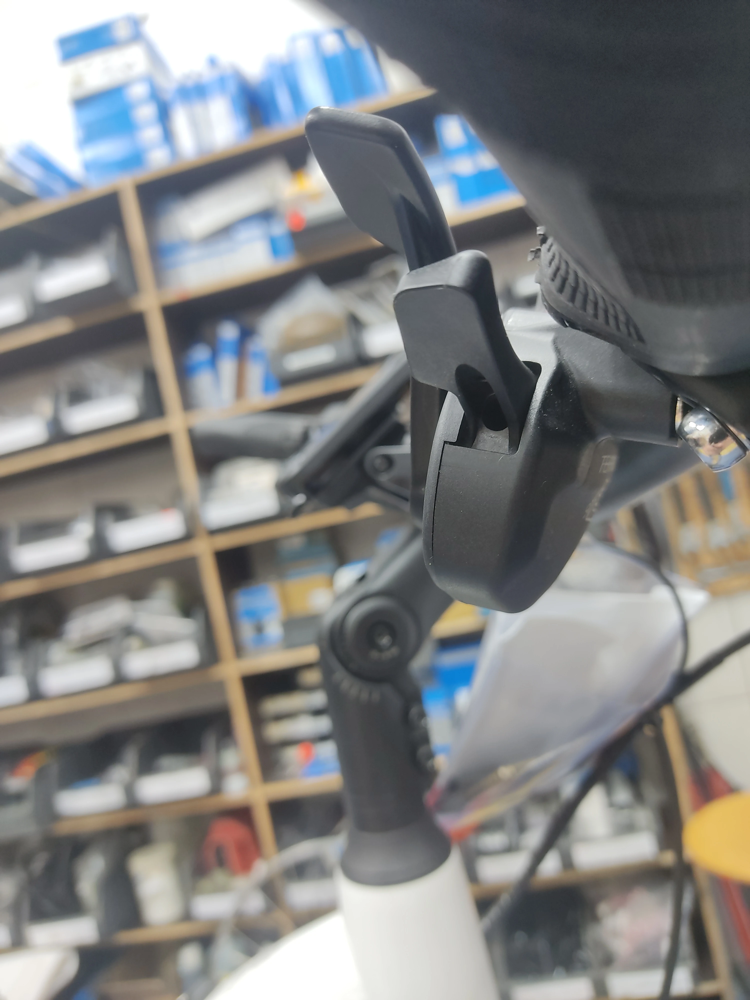
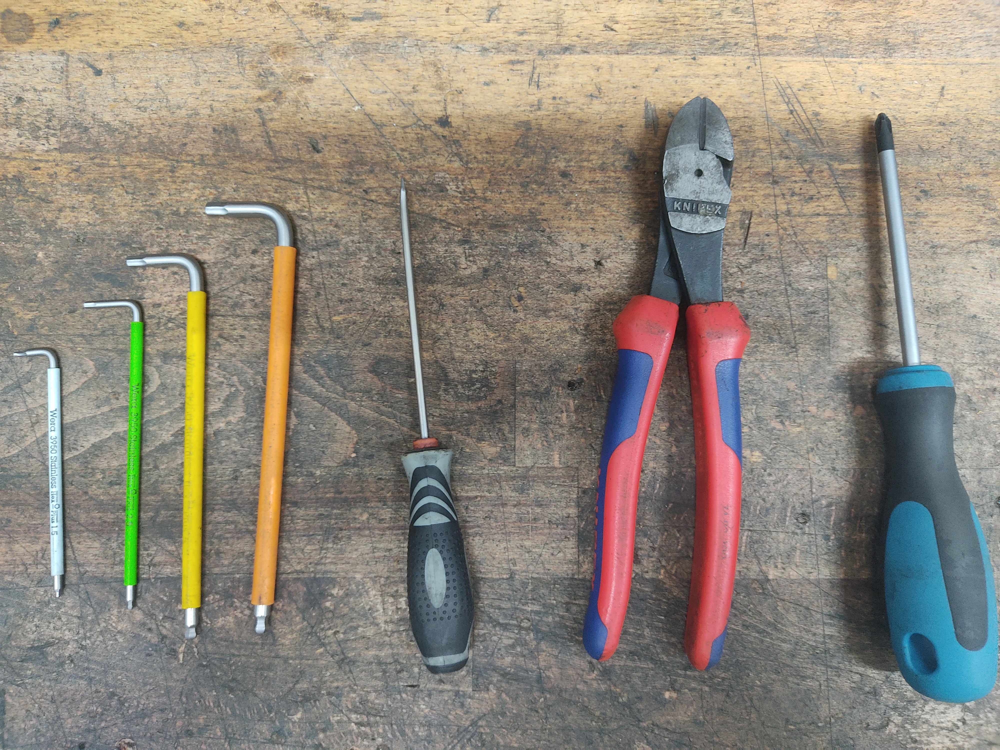
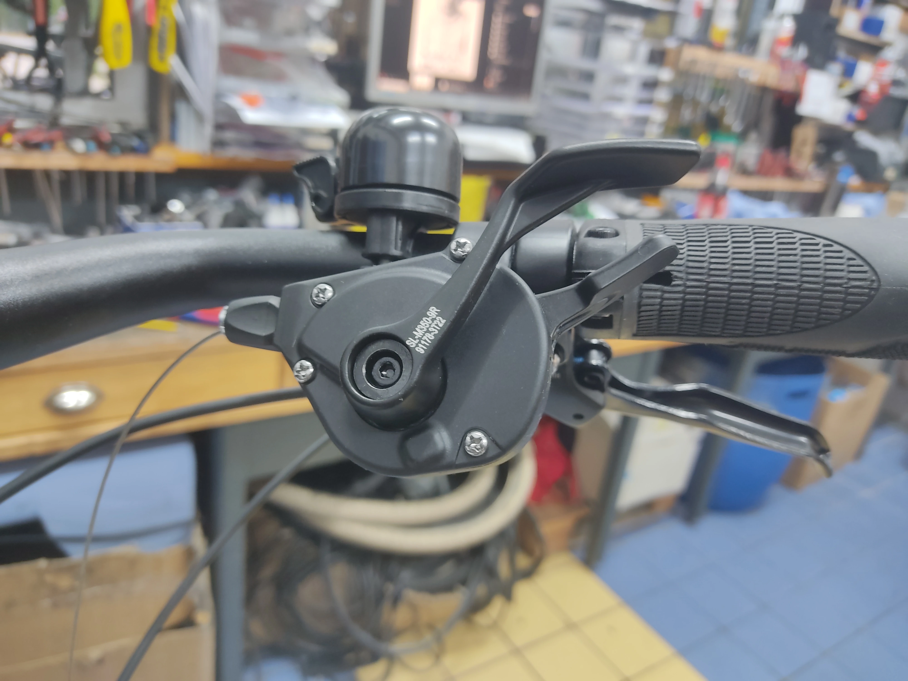
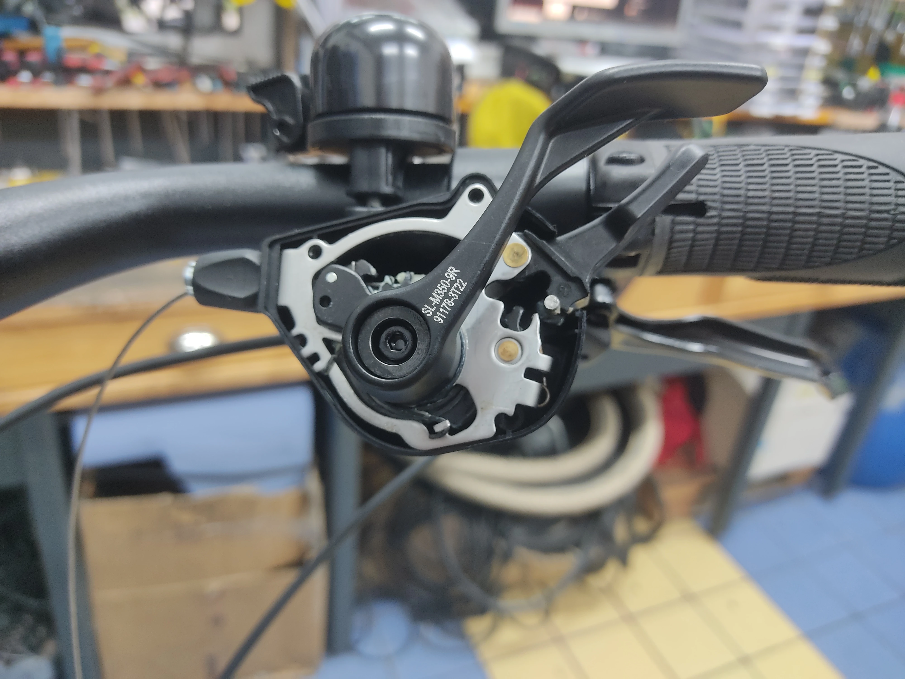
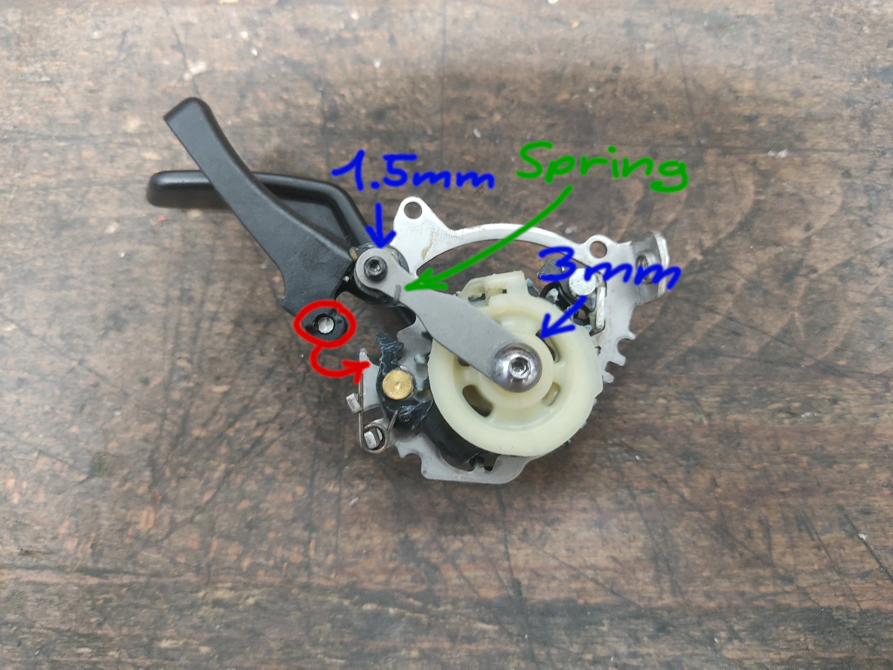
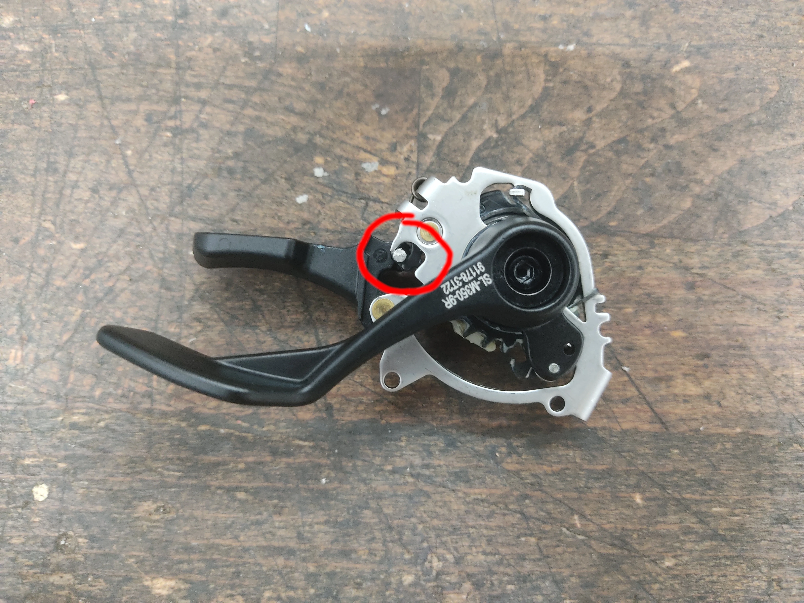
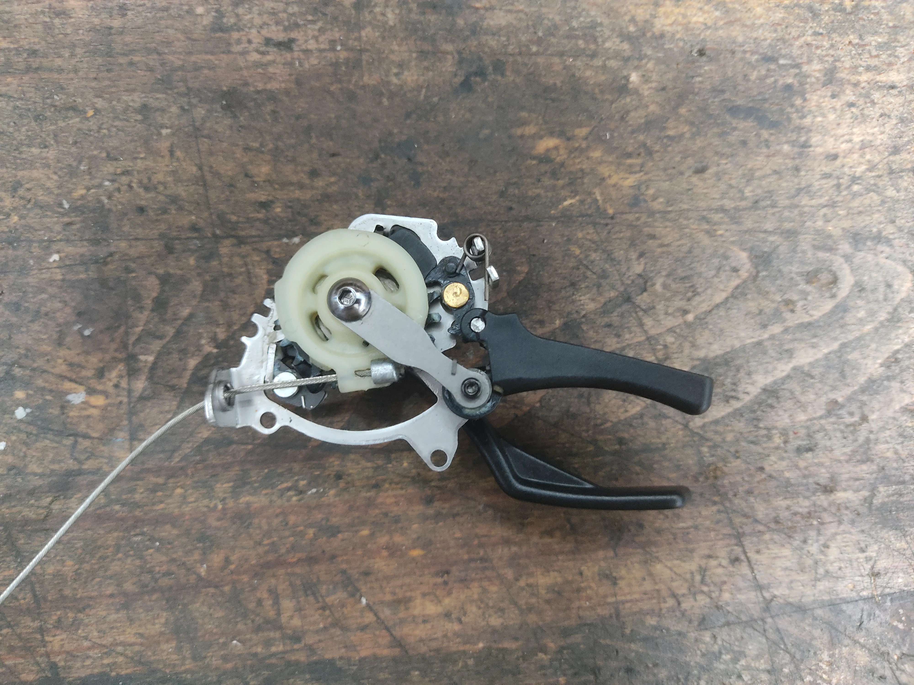

+++
title = 'Fixing stuck Tektro E9 Shifters'
date = 2024-06-17
draft = false
+++

In most regards Tektro's first groupset, the E9, has been a mature and excellent product, especially for a company so new to the field of shifting. Well thought out details, a good gearing selection, and shiftfeel that eclipses both the old Shimano Alivio and new CUES U4000 9-speed groupsets.

"Most" however is doing a lot of heavy lifting. People familiar with the groupset may already know what I'm alluding to, it's the downshift action. Unlike with Shimano, where the downshift lever works by pull (and push, depending on the model), the Tektro lever is push only. This wouldn't be bad, were it not for the fact that *pulling on it can brick the shifter*. The warning sticker is a good idea, however in the hands of customers (and in one instance a mechanic), it has not enjoyed a flawless success rate.

(I did that one on purpose)

The lever can be unbricked. It's not an entirely smooth and easy process but once you know *how*, it is not too daunting. Since I have not found any documentation describing the process, I figured it was high time to do so.

You will need:  
* Hex keys, 5, 4, 3 and 1.5mm
* A philips Screwdriver
* Sidecutters
* A flathead screwdriver or something similar for poking
* A new shifter cable

Start by cutting the shifting cable at the derailleur, then remove the rest of the cable still clamped on it. You can then extract the cable from the housing, just leave it dangle for now. Next loosen the clamp bolt of the shifter and rotate it so the underside faces you. Luckily the shifter housing can remain on the handlebars for the process.

Open the housing by removing the 3 philips screws. You can rotate and then slip the lid over the downshift lever and out. Part of the lid is raised specifically for this purpose. Put the lid and screws aside.

Next, remove the barrel adjuster from the housing and put it where you put the lid.

Now you can remove the guts of the shifter. Once out you can remove the cable.

Looking closely, we can see how things have gone awry. To fix the shifter we have to move the post circled in red back into the groove its supposed to be in. Loosen the 3 and 1.5mm allen screws denoted in blue.
After that you will be able to carefully lift the lever up and move it back into position. Make sure the tension spring (noted in green) stays where it is. If it doesn't, gently nudge it back into it with the flathead. Retighten the screws.

View of the other side with the post back in position (circled in red):

Test the guts for correct function, then shift all the way up into the highest gear. Reinstall the cable. This can also be done at a later point but i found it to be easiest done with the innards still out.

Reinstall the shifting mechanism and put the lid back on, then screw the barrel adjuster back in. Swing the whole assembly back into position and reitghten the 4mm hex bolt

Pull the cable through to the derailleur, install as normal adjust tension, and done. Keep in mind that cable tension will usually be a hair lower than it is with other systems.