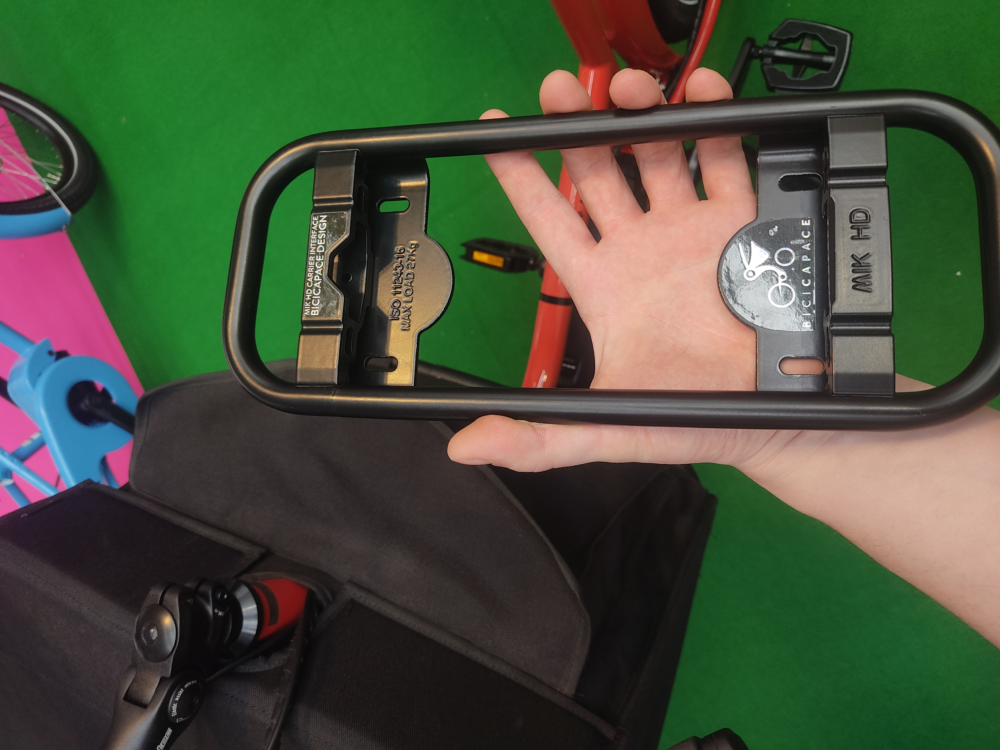
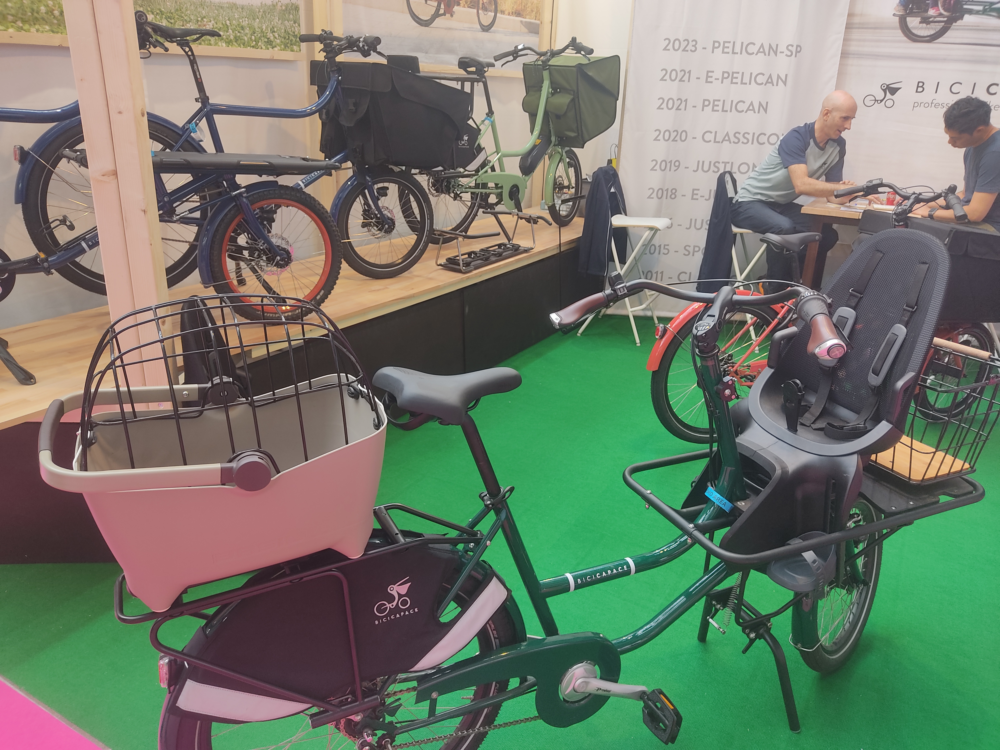
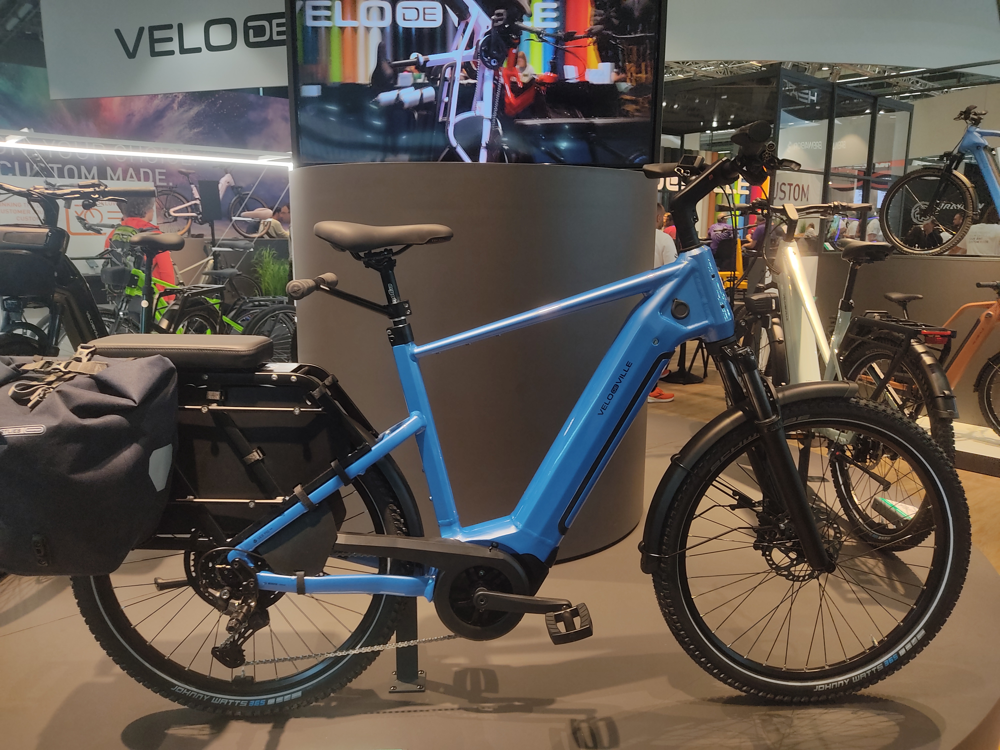
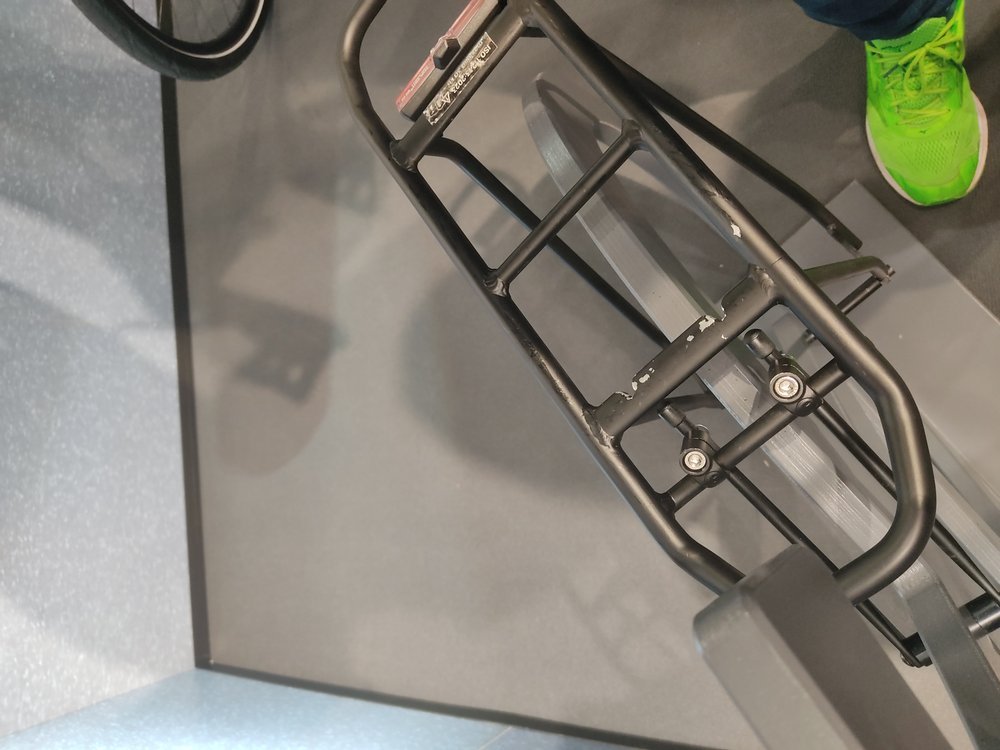
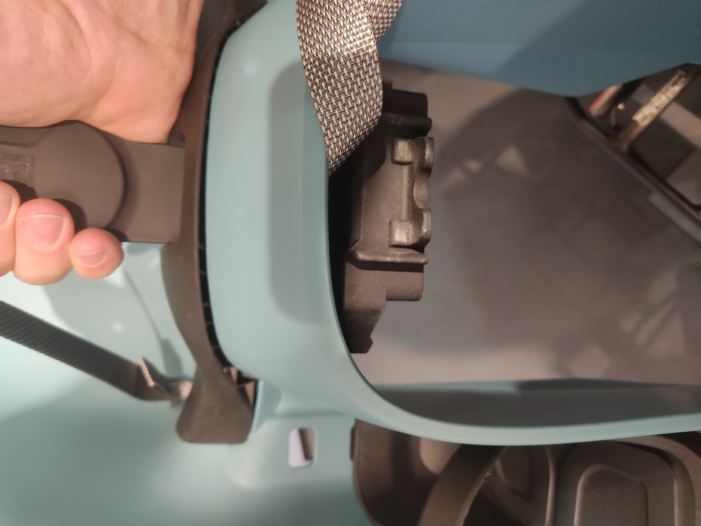
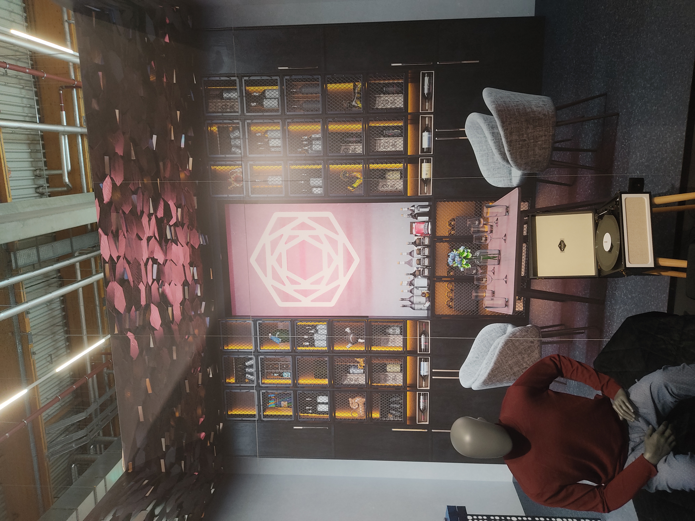

+++
title = 'Eurobike 2024, Part I: Clash of the Carriers'
date = 2024-07-05
draft = false
+++

It's summer again and that means the world of cycling congregates in Germany for Eurobike.  
The switch from Friedrichshafen to Frankfurt has been very welcome on my end, Lake Constance may be nice but in many regards it was what Berliners call "JWD" (janz weit draußen, way out). Every year the Lake Constance highway would be inevitably *clogged* on sunday night by the collective masses trying to get back to Frankfurt and out of the country.  
It thus seemed only prudent to move the show to where everybody wanted to be anyhow.  
I'm staying the full 3 vendor days and figured I might as well add my observations and opinions to the deluge of those already out there.

One of the quote unquote trends of the show seemed to be high-load versions of carrier snap-in systems.  
Longtail cargo bikes are getting ever more popular (and certain normal bikes are also getting ever more cargobike-y), so solutions for rapid installation and removal of child seats and the like are in high demand.  
While a whole host of systems for baskets&co already exist, these systems are usually not intended for the high loads that a child for example places on a mount.  
Market leader and only option thus far has been **MIK HD**, derived from MIK (who'da thunk). Common across all of these systems is their downward compatibility. Any MIK accessory will also fit a MIK HD rack, but not vice versa. Eurobike 2024 shows companies are clearly not content to surrender that market to MIK altogether, with two established manufacturers throwing their hat into the ring.

 
Bicicapace are flying the MIK HD flag with aplomb, their new mounting kits just bolt onto various points on their cargo bikes. Pictured is their "Pelican" with 3 adapters, configured as a dog basket, a child seat and a regular basket.

An excellent example of a regular bike encroaching on the cargo market. Velo de Ville are showing off a new rack option for their SEB line. 60kg max load, more length and a MIK HD interface comfortably allows for a child and two panniers.

**AVS+** was expected and teased prior. Bobike was already showing off versions of their Go Maxi workhorse seat with AVS+.  While I love AVS to bits (it may well be my favorite system), use of AVS+ is not as simple and graceful as regular AVS. Part of that, of course, is by necessity, all the high load systems require a double-action unlocking mechanism, lest some careless fidgeting sends a child flying. Implementation of a lock is handled very well on AVS+.

The real surprise was Hebie/Racktime. The good people of Münster are going all in, tying the system to an entirely new brand **"Carl&Marta"**. Core of the brand are new racks, made in Germany, but also bags and childseats to go with them. The racks will be OEM exclusive for the time being, the accessories of course won't. Costs are higher with local production, but manufacturers are increasingly willing to pay a premium for parts with a lower CO2 bill and steadier supply chain.  

If this looks like a racktime Snap-It 2.0 with two grooves filed in, that's because that's what the prototype essentially is. The grroves don't serve a functional purpose and are mostly there to prevent use of high-load accessories with racks that are not rated for them.

The seat is a rebranded Urban Ikki, something that I expect will stay the status quo for a bit. Action felt decent on the 3D-printed prototype, which leaves me very optimistic about the production version.  
In terms of accessories they were showing off two trunkbags, a stylish handbag type with roll closure that kinda looks like a paper bag, and a backpack that snaps into the top of the rack, somewhat like the Atranvelo Metro Messenger. Even being under the new brand, I expect these to be compatible with regular Snap-it 2.0 racks.

I think the Carl&Marta logo kinda looks like the [Carpenter Brut](https://carpenterbrut.bandcamp.com) one. Carpenter&Marta?

It's definitely going to be an uphill battle for Racktime and AVS to get even with MIK, one which will be fought in the fields of OEM spec. Besides pricing and licensing fees I can imagine that the size and supply of the accessories ecosystem may ultimately tip the scales. Decisively? Unlikely. Within the Non-HD space there are 6 or more systems already existing in parallel already, so I expect things to stay heterogenous.