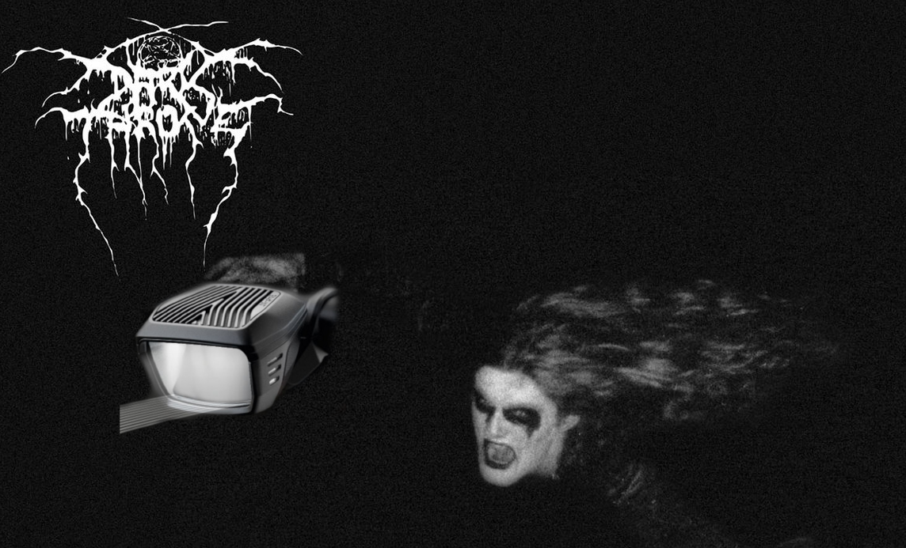
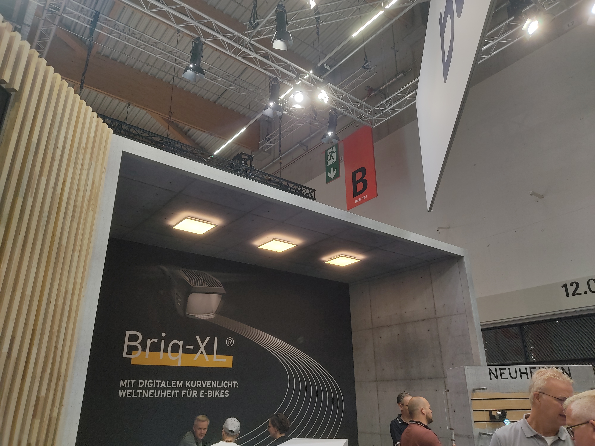
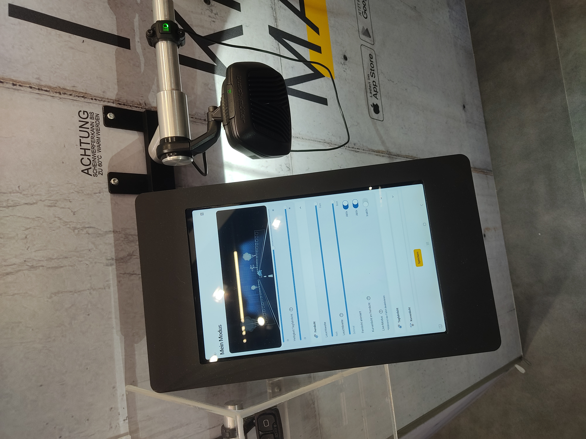
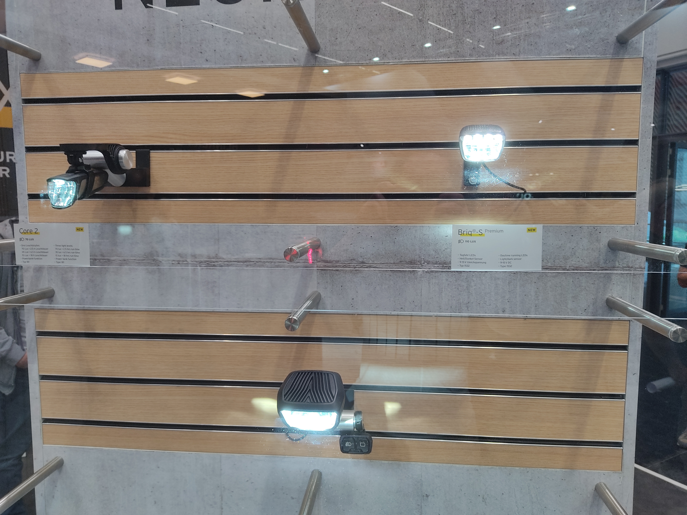
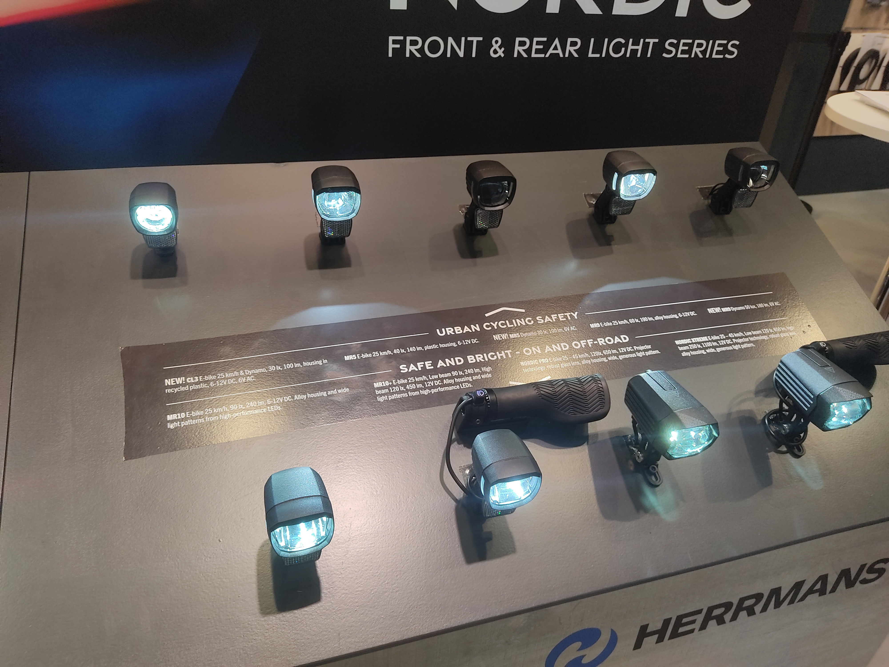
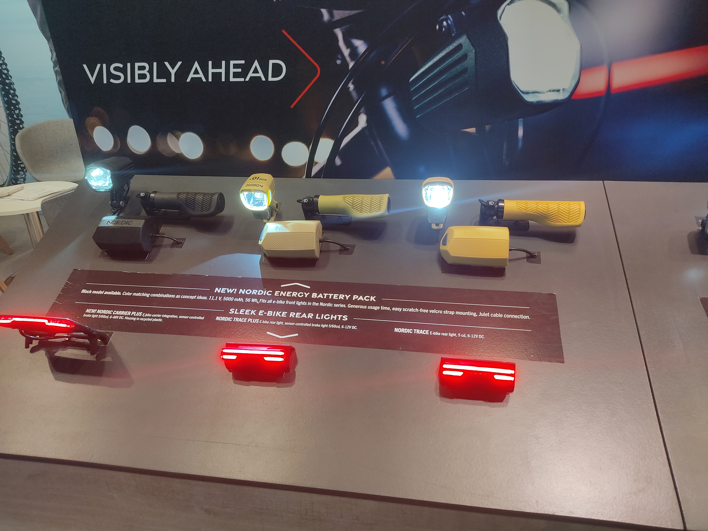

+++
title = 'Eurobike 2024, Part II: A Blaze in the Northern Sky'
date = 2024-07-06T22:11:18+02:00
draft = false
+++

If you ask me, the two European titans of bike lighting right now are Herrmans and Busch&Müller. Both manage to create well designed lights for E-Bikes and dynamos with local production at scale and a pricepoint relevant to OE use. While other manufacturers are also present in this market, I've enjoyed their products the most, at least as far as the mass market is concerned.  
Historically Herrmans has been the choice of the more value-minded product manager with Busch&Müller being the more premium choice, offering more well engineered optics and a better build. The past year or so however both companies have made forays into the other's space and the result has been an incredible back and forth with great products releasing left and right.

All the way back in 2021 Herrmans released the Nordic Pro/Xtreme squarely aimed at the high-end market, giving the company a real flagship light for the first time. Compared to it's direct competitor, B&M's IQ-XL, the Nordic Xtreme actually delivers less light for slightly more money (at least aftermarket), however it is always worth mentioning that raw numbers don't tell the whole story with lights. The beam on the Nordic Xtreme is a bit brighter, but the IQ-XL delivers a broader beam that is also more even. With lux being a product of both light output and surface area its readily apparent the IQ-XL has an advantage in the numbers. However some people may prefer the more focused output of the Nordic (not to mention the fact that the IQ-XL, for all it's brilliance, looks horrendous visually).
The high end market is more of a prestige thing so the really important bit came last year when Herrmans launched the Nordic MR series, aimed to succeed the H-Black line, starting with the MR9. My first contact with the MR9 came when Velo de Ville started offering it on their custom bikes as an equal-value option the Busch&Müller Myc. 60 lux from Herrmans and 50 from B&M was one thing but when I compared the two directly on a late evening at the shop the Herrmans cleanly came out on top in terms of both quantity and quality of light. This marked a stark departure from Herrman's prior "H-Black" lineup which always played second fiddle in terms of light quality to the German offerings. Herrmans are putting work into their optics and it shows.

While Herrmans was upping their optics game Busch&Müller has evidently worked on their value engineering, releasing their new "Briq-S" earlier this year. Describing the Briq as anything less than a bombshell would be short-selling it. At 40€ for the top model with sensor activated daytime lights the Briq-S offers unprecedented value in terms of the light it can deliver. Offering 60 lux just like the Nordic MR9, B&M are one-upping Herrmans on their home-turf, the value preposition. 
B&M is keenly aware that the mere existence of the Briq-S is mortal to the rest of their low to mid-range lineup. The Dopp, Avy and Eyc will all be casualties and they are expected to be phased out. Long live the new flesh I say and so does B&M. The amount of Briqs I saw on bikes at the show tells me the gambit has worked.  
All this brings us to Eurobike 2024, where neither brand seems to be content to rest on their laurels.

Starting at **Busch&Müller** and their wonderful brutalist booth, there is a new flagship.  
The Briq XL stands in the long line of B&M products that don't try to solicit ever more power for their LEDs and instead employ the light they have have in smart and innovative ways. The Briq-XL iterates on the, in my opinion, somewhat crude Leval curve light setup. Instead of a motor and gyroscope physically keeping the light level the Briq-XL instead employs a microprocessor to control it's bank of LEDs, a technology Busch&Müller calls digital curve light. As the bike tilts in corners LEDs dim/brighten to keep the beam consistent. The light can be further fine-tuned by an app. Pricepoint will be an eye-watering 480€ or so, but such is life with flagship products. The tech is seriously impressive.

The really interesting product was the Briq-S Premium, an iteration upon the Briq-S. 110 Lux at what is expected to be a 55-60€ price is frankly ludicrous, maybe even moreso than the original Briq-S. Of all the products shown at Eurobike this is probably the blandest one that has me the most excited at the same time. Sadly, it's gonna be E-Bike only, no dynamo version.  
Also shown: the Core 2, the first of a new generation of battery lights. USB-C at last!

**Herrmans** meanwhile is further iterating on the Nordic MR series, in both directions.  
On the low end the MR5 and the CL3 are new with 40 and 30 Lux respectively. The MR5 is a mirror design, the CL3 uses a lens, both come as dynamo and e-bike variants. It's good to see more work being done in the low-end. I didnt get info on pricing yet (much less the critical question of, how will OEM conditions look) but these have to target the sub-Briq market for it to work.  
In the other direction there is the Nordic MR10 and MR10+. The housing looked identical to the MR9, the upgrades are on the inside. Herrmans puts the output of the two at 90 Lux, the MR10+ receives a further bank of LEDs for high beams. In high beam mode output climbs to 120 Lux. I forgot to ask about the normal MR10 but the MR10+ will be around 90€, providing an excellent entry point into the world of high beam lights.

The MR10+ is probably the product that piqued my interest the most at Herrmans' booth, it's a bit of a shame neither MR10 nor MR10+ will come in dynamo versions (parallels to the Briq-S premium all around). I can only speculate as to why, the 4W powerdraw of the MR10 is well within the envelope of a generator hub. The 9W for the high beams are a taller ask for sure though.  
Also new from Herrmans: the Nordic Energy. At it's core its a 5000mAh power bank, what sets it apart are the ability to easily mount on a bike with velcro straps and being able to power every single e-bike light Herrmans currently produces. The icing on the cake would be a rectifying circuit to allow charging via dynamo DC power, but it's a really neat idea nonetheless.

It's safe to say the lighting space is staying exciting. While products like these rarely grab headlines, it's an area that is definitely tangible to the end user and thus shouldn't be overlooked. I don't know whether or not there is an actual rivalry between the Finns and Germans here, but given the pattern and pace of product launches it becomes easy to believe. In any case the bike market as a whole is a clear winner in this rivalry, being inundated with quality lightsources.