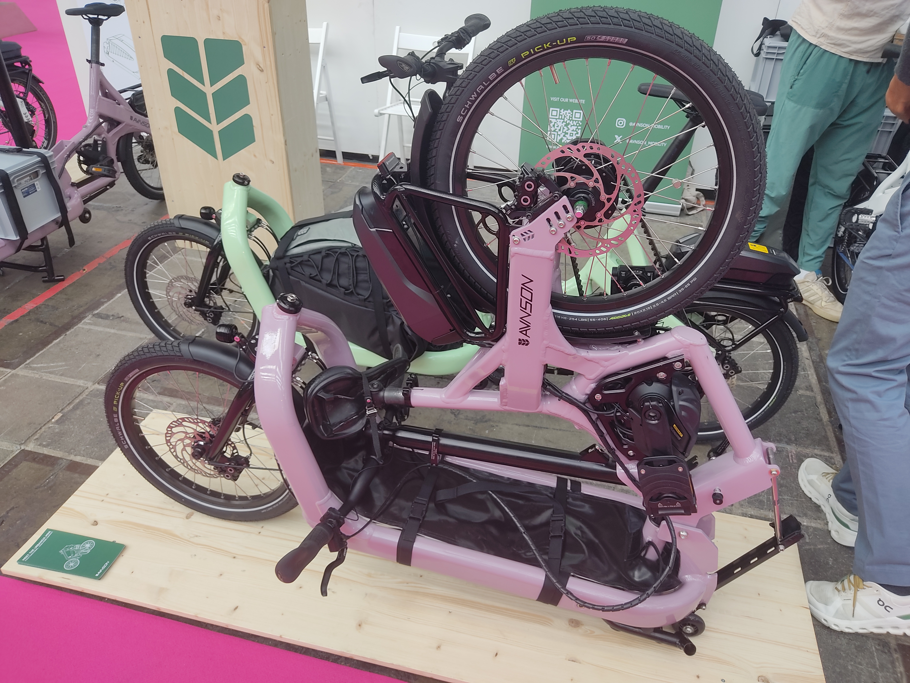
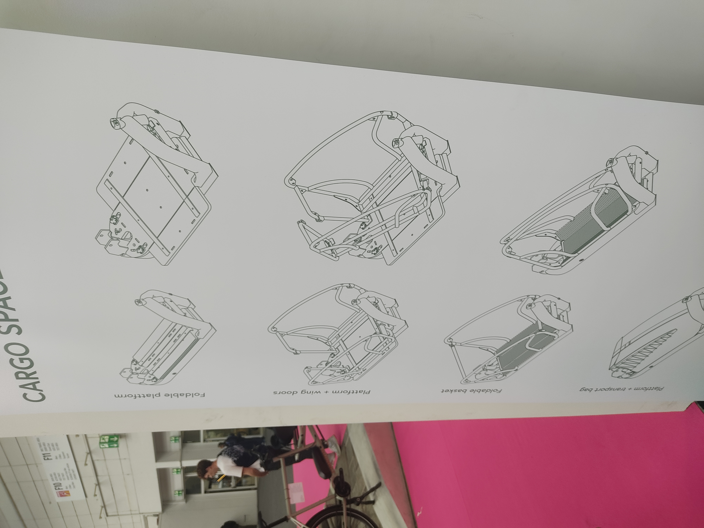
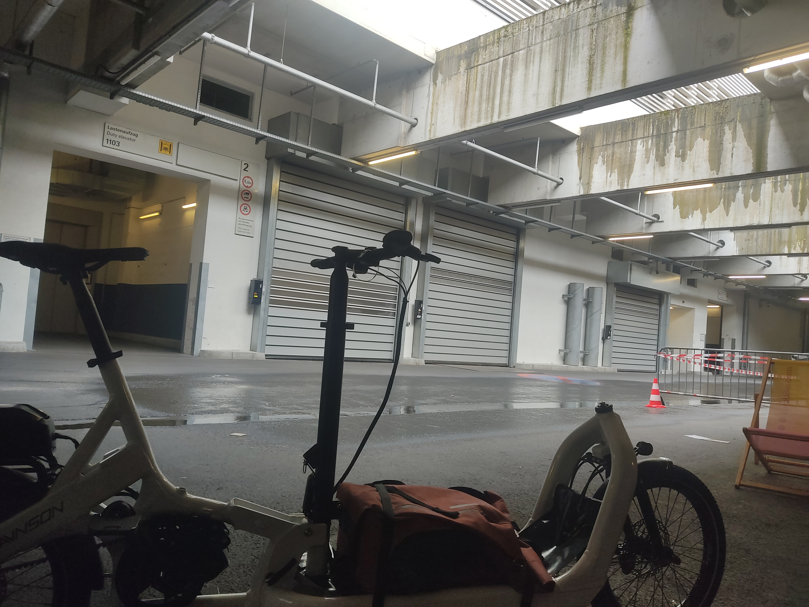
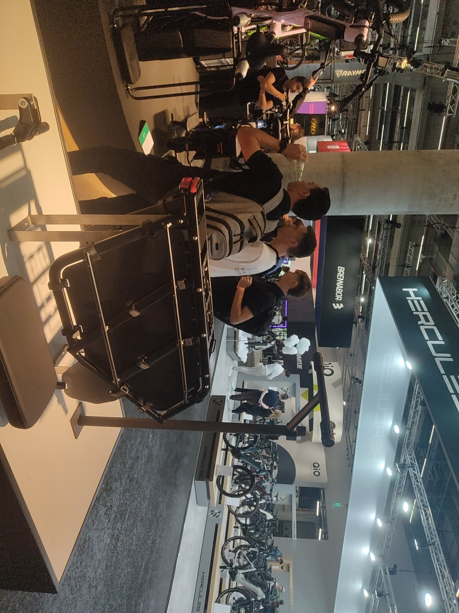
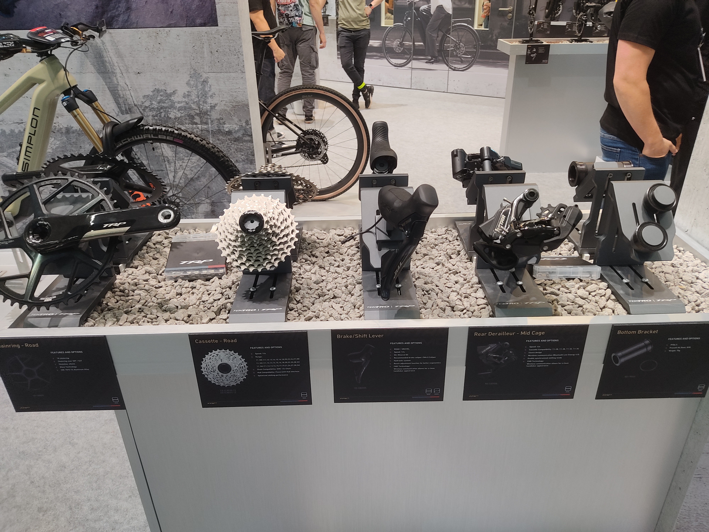
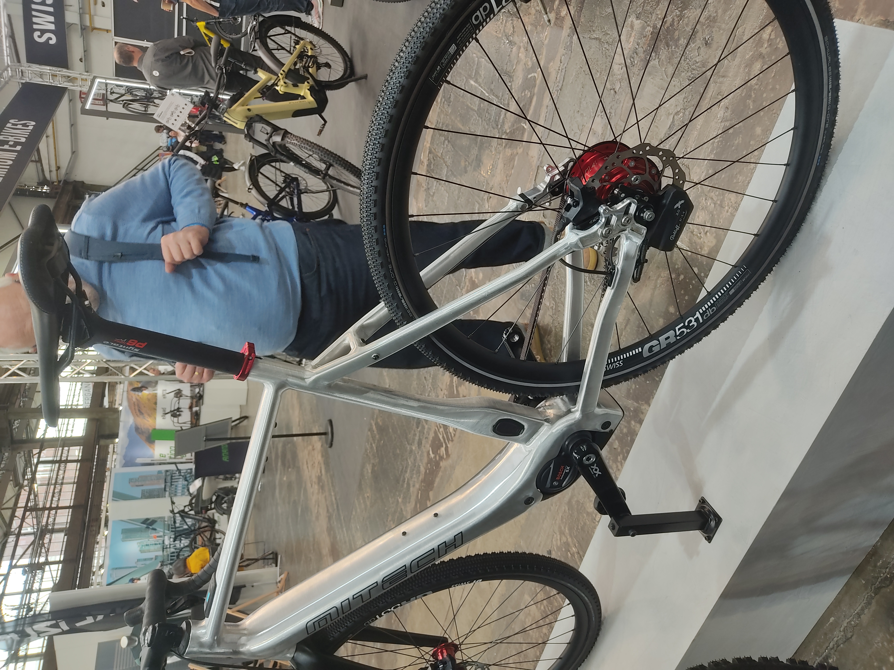
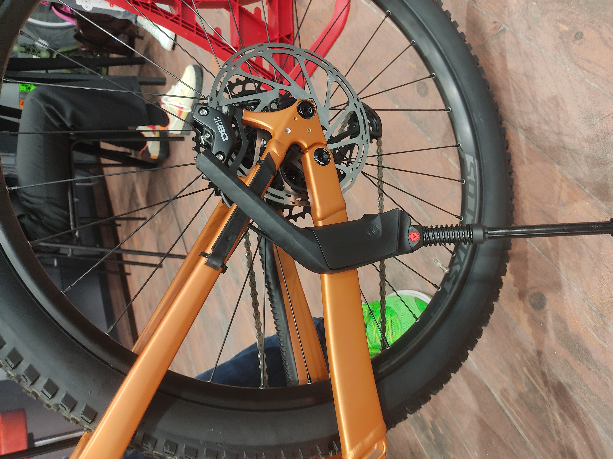

+++
title = 'Eurobike 2024 Part III: Thoughts on the Schwalbe Clik valve and everything else I forgot'
date = 2024-07-08T14:19:26+02:00
draft = false
+++

This is the last part of the eurobike trilogy, all the leftovers, it's gonna be a bit long.

Schwalbe's new valves were the talk of the show. In fact I cannot recall a single booth being quite as crowded (apart from Cosmic's on wednesday night but they had margaritas and tacos at the time). Apparently they were giving out samples on wednesday but by the time I got there on thursday that practice had been halted, due to overwhelming demand. The good bits of info weren't really at Schwalbe anyhow, it all seemed to get a bit lost in the marketing mishmash, the real scoop was at SKS, their partner for the pump heads.  
So let's run down the observations:

These things work as advertised. Attachment and detachment is a breeze, little to no air loss upon removal, letting air out is much nicer than with Schrader valves, though not as nice as Presta. In terms of pure function this is a knockout.

You can easily change valves to Clik by swapping the core and vice versa.

Presta pumpheads work with Clik. I was not able to test or get further on this though. How well does it work, will all Presta heads work (think screw-on like with Lezyne)? Time will tell. I will tell. I've ordered a few sets, delivery is expected for September.

Schwalbe has an exclusivity deal on these. *However* this is timed and only for Europe. No word on how long.

SKS will offer pumps for the valves. I think the more sensible option at least for the time is the adapter that Schwalbe also provides. The new pump heads are Clik *only*, which means that anyone else who wants to bum your floorpump because you are the only one in the neighboorhood with a half decent pump either has to convert to Clik also or is SoL. Great times for evangelists. On the other hand I get why you wouldn't offer multivalve, if your expressed mission statement is to supersede both Schrader and Presta.

Price is 6€ for just the valves, 14€ for valves plus pumphead adapter. This seems pretty reasonable, low enough to entice one to go "eh why not, let's give it a shot".

Schwalbe seems to have all their bases covered for this to not become ProCore 2.0. Conversion is easy and low-cost, there is backwards compatibility and the valves solve a legitimate issue, as anyone who's seen the less mechanically inclined handle Presta valves will be able to attest to. I can see the gambit working. The market at large has to take to it and this will make or break the effort. Schwalbe's exclusity will be the largest obstacle here. If the Clik valve can maintain momentum until other manufacturers can jump on it, this may well become the new standard. Finger's crossed.

Favorite bike of the show was the folding cargo bike(s) that Avnson showed. The company is new, the product is new, their website still shows CAD renders. But the physical product they were showing was impressive as hell and struck me as essentially market ready, barring some spec oddities on the prototypes.  
Cargo bikes being spacehogs is not a new phenomenon/issue. Bikes like the Tern GSD or Yuba Fastrack already offer a compelling option by simply parking upright resting on their rear end. But options for frontloaders did not yet exist, at least not to my knowledge. The way the Avnson folds is that essentially the rear end of the bike, steering column included folds over the load area. A set of skateboard-esque wheels then deploys and allows to roll the whole package around. It's certainly no Dahon in size but an impressive reduction nonetheless.

The front loading area is highly modular. It's easily built out to carry two children, protected from the elements. Apparently two children fit, regardless whether it's the long or short version of the bike. The cargo configuration will be carefully dimensioned so that standard size euroboxes simply slot in, at least that's the plan for the production version.

Steering is handled with cables, on a bike like this it's the only feasible option and I much prefer that approach anyhow over the classic linkage driven systems. And hallelujah, no Cane Creek Viscoset to be seen, these things ruin the feel of the steering anywhere they pop up. Turning radius is fantastically tight as expected and the bike handles just fine. It's not revelatory like that but a very good performer. I'm excited to see where this goes.

(Dramatic lighting and backdrop for my testride)

Velo de Ville was showing off a fairly nifty longtail called "Loady" but I was more interested in what they have since unceremoniously dubbed the "SEB HD" rack. This is a simple upgrade for their "SEB" (**S**UV **E**-Bike **B**osch) model line, Velo de Ville's custom program just lets you slot that rack in as part of your bike order.

This vastly beefed up rack can take up to 60kg of load. A MIK HD platform, the same part already in use with their modular racks, allows for child seats or cushions, extra bars to hold on, footrests and comprehensive spoke protection make for a full fledged child transport option. The extra length of the rack even allows adding panniers, without clashing with passengers. 4 Panniers are also an option for people in need of extreme cargo capacity.

In my opinion this is utterly brilliant. Simply by introducing a new *part* Velo de Ville is taking shots at bikes like the Riese&Müller Multicharger. There is a common issue with regular bike manufacturers penetrating the cargobike space and that is add-ons and long-term support. This is part of the reason I still very much like companies like Yuba, even in an age where advanced long-tails appear left and right. I know they're in it for the long-haul (no pun intended). This is also the reason why I'm still somewhat cautious about the Loady, much as I liked the looks of it.
The SEB HD Rack sidesteps that issue by intentionally limiting it's scope. Weather covers, backrests, etc, won't be provided and likely won't be missed. Even if the seat cushions disappear from the market it's still a regular SEB once the rack is swapped. Less of a cargobike and more of a bike with a little extra. I'm a big fan of flexible common platform frames and the SEB in it's current state really sets a benchmark.

TRP and Tektro are ramping things up. Not content with slowly eating Shimano's pie in the low-end brake sector (and slowly inching towards the upper end at the same time), they are expanding their drivetrain lineup also. Big thanks to Dave from TRP USA for showing me around and humoring me [and my gripes about the E9](https://www.wolfgangwiedervorname.de/posts/240617_fixing_tektro_e9_levers/). The Vistar groupset in collaboration with Classified hides a bigger story. What it is, is essentially introducing di2 sychroshift to a Classified Powershift drivetrain. Only instead of the front derailleur being automated its the new age SRAM dual-drive in the back. The whole thing being built with the Classified hub in mind also allows them to ditch the little bar-end pod that setup usually needs.

Calling it tailor-made for the Classified would be underselling it though. The real kicker in all of this is that *TRP is building their electronic shifting as an open standard*. Anyone who wants in on it can. Pinion we already saw last year when the HyWire brifters first showed up but Rohloff (IGH), Kindshock (dropper posts) and even Bosch (e-bike motors) have already come on board. Bosch plans to offer similar functionality to what Shimano is already doing with Freeshift/Autoshift on Steps+Di2 setups, which is to say automatic or semi automatic derailleur shifting.  
I sadly didn't get to ask about non-Classified electronic derailleur drivetrains but I did finally manage to get hands-on with the HyWire brifters on the test loop, in combination with a Pinion gearbox. I came back thoroughly impressed, shiftfeel and ergonomics finally deliver on what I always wanted from Rohloff dropbar solutions for a decade but never got.  
Speaking of Rohloff and TRP they were already showing a MiTech gravel e-bike with just that combo at Rohloff's booth. This wasn't actually the first time I saw that bike, that was in Düsseldorf earlier this year but at the time I assumed it was a hack of sorts on MiTech's part. The news from TRP suddenly made everything click in my head. I asked Rohloff about the prospects of their electronically actuated E14 coming to non-e-bikes also at some point. The intent/desire is definitely there, they just haven't figured out where to put the battery yet. No comment.

(This was from Düsseldorf)

One last small bit: Hebie showed a kickstand for fullies. The usual issue with the 3-point clamp kickstand is that on most suspension setups the seatstays move relative to the chainstay, thus making these kickstands impossible to use. Hebie's approach is to add a rail of sorts to fix the mounting point axially, but retain radial freedom of movement.

(I hope my words are making sense, here's a photo)  
This provides a good solution to commit an affront to god, a long needed one. Many a customer only realizes after purchasing a cushy fancy new full-suspension e-mtb that *wait a minute this thing doesn't even have a kickstand, I thought all bikes did*. And many of us shop-monkeys need to come to terms with the fact that once you sell the customer that bike it's no longer yours, it's the customer's. And so, on goes the kickstand, whether we like it or not. And now there's at least a somewhat decent way to do it.