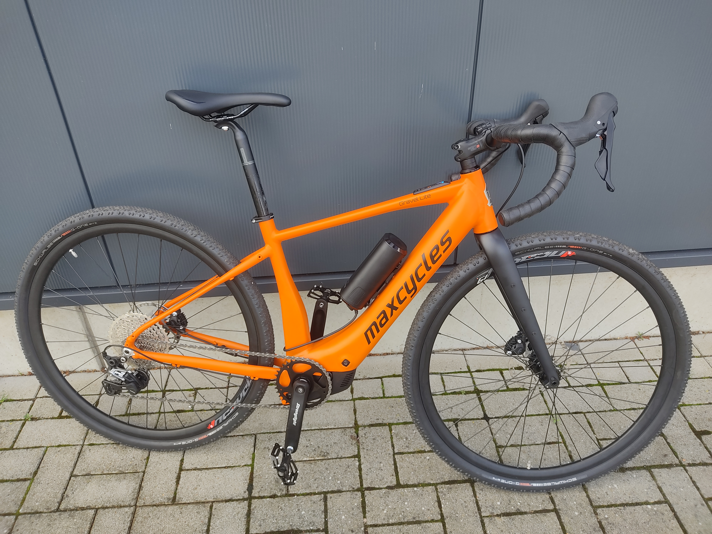
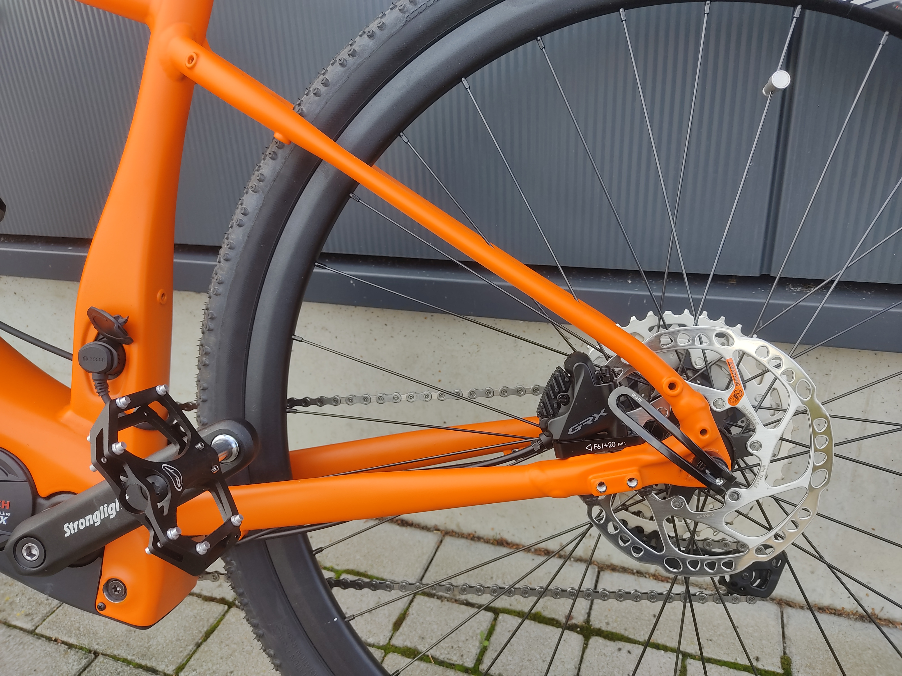
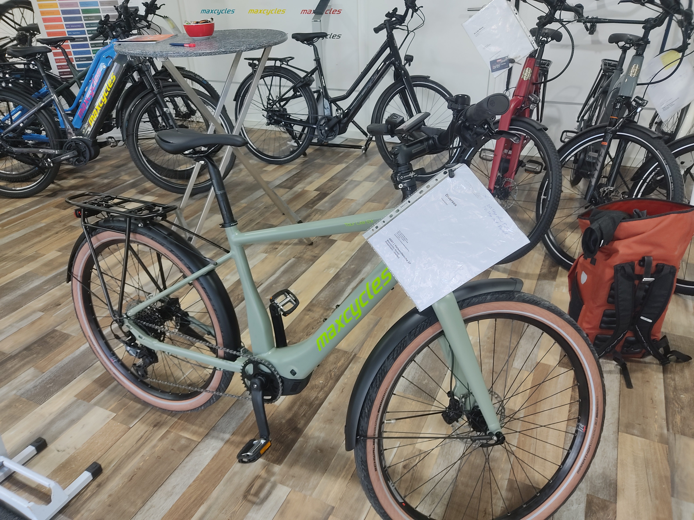
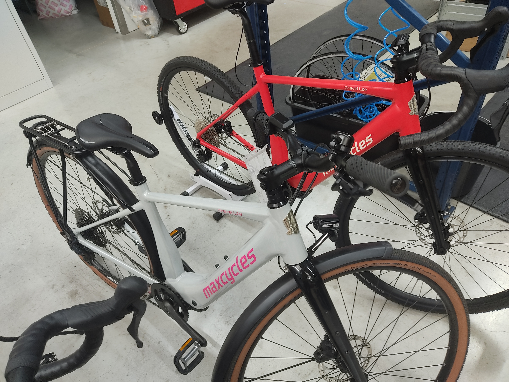

+++
title = 'SX-Appeal: Maxcycles 2025'
date = 2024-10-19T15:07:38+02:00
draft = false
+++

Two occasions usually bring me to the lands around Münster, both are bikes. I always greatly enjoy my time there, gently rolling hills, red brick houses dotted btween, time seems to pass a hair slower whenever I'm there.  
Just a bit north of the city is Velo de Ville with their now massive facility, two factory halls, flagship store, offices et cetera. If one takes the train west, coupled with a small bike ride you end up at Maxcycles and their much more humble abode.  
A lot less busy than Velo de Ville, a good chunk lighter, more attention to detail, but also a good chunk more expensive is how I'd describe them by comparison.  
The time had come again in September for their in-house presentation, so I made a stopover on my way north to a wedding, to gaze at new models, discuss bikes and maybe have a few snacks.

 A well built by a local saint of sorts. I didn't get any pictures of the landscape so this will have to do.

This year was very much under the auspice of the new(ish) Bosch SX Motor. The SX is more or less Bosch's response to the TQs and Ebikemotions of this world, without looking like a me-too product. It enables lighter e-bikes, but not freakishly light ones, it comes with a smaller battery but not a drastically downsized one, and it is still a mid-drive. Minimal assist, Bosch style.  
Quick hard facts: 55Nm max torque, 600W peak support power, ~2kg weight (compared to 2.9kg on the top-power CX Motor), usually spec'd with a 400Wh battery.  
The raw numbers don't tell quite the whole story: The SX has some quirks which will endear it to certain people and make it awful for others. The support characteristics are very much geared towards people who usually ride bikes, bluntly put. The SX will not let you coast along at 30RPM going 25km/h the way you'll often see people doing. You will actually need to put in cadence to get something from the motor. When I tried early versions last year I found myself not wanting for power in the slightest, but I do not ride an e-bike on a daily basis. The motor is extremely quiet but it does still feel like you're on an e-bike for lack of a better word, more like a Shimano motor, and nothing like the ultra subtle motors like, say, TQ. A goldilocks affair to me.  
Still, this is not a motor for everyone, and something you can't just slap into your lineup willy-nilly, for example the way Velo de Ville did with the KEB590. A compact bike spec'd with the SX for some reason, it is still extremely heavy and compact bikes will usually feature the one demographic that actually DOES mind the lack of a kickback brake option. Not to mention usually not being high-cadence, a mediocre time for everyone involved.  
This is not an isolated incident and a fact I have seen bemoaned from sales reps, both Bosch's and affected manufacturers. We can only speculate as to the why. Did Bosch communicate the characteristics of the new motor not well initially? Did nobody listen? Did Product Managers severely suffer from "new toy syndrome"? Supporting the first two points is the fact that I have seen several of these bikes initially offered with kickback hubs, a spec that was then quietly pulled as the incompatibility started to seep through to product management.

I am happy to report Maxcycles did none of the sort. They are bringing out two new models with the motor and both of them are sound and conceptually reasonable.

The first one is the Gravel Lite SX. You can trace a fairly direct lineage from this one to the non-motorized Gravel Lite that launched last year. Same dropouts, same fork, same rear end, etc. The base layout is one we should've seen our fair share of at this point with all the SX-based gravel bikes. Alu Frame, CF Fork, 12mm Thru Axles front and rear, Bosch System Controller, non-removable battery, mounts for the everyday necessities (though the 18mm kickstand mount isn't as common), Powermore compatibility. Geometry should be the same as the normal Gravel Lite, which is outstanding, I'm a big fan of how that bike feels and handles. During my testride they did indeed feel very similar.
Color choice and spec details are as expected of Maxcycles. The big options are 11 or 12s GRX and the option to add lights/kickstand/mudguards/rack. The usual host of colors is available. Weight starts off at a fairly reasonable 15.9kg for the lightest spec.

The Tour Lite SX is the more "normal" option, an outwardly trekking bike. It's good to see manufacturers not simply slapping flatbars on their gravel frame (more on that later though). The Tour Lite is an all Aluminium affair, sliding dropouts QR axles and belt drive compatibility. On the Diamond frame version the battery is fixed in place. The not yet finished Wave frame will offer a removable battery. Apparently this was a matter of space constraints on the former, the preferred option would have been to have the battery removable on both. A mixte frame I quite liked the looks of was on display but I was asked not to show it since it is merely an early prototype stage of what will become the wave frame so it's in no way representative of the final product.  
The spec options have some quirks. An internal gear hub+belt drive is possible but only for a Rohloff Speedhub, no Shimano Nexus 5 option to be seen. I was told this was due to the Nexus having a fairly tight chain/beltline (45.5mm vs 51.7/54.7 on Rohloff), however I *know* of several SX bikes offering exactly that combination, so what gives? Maybe it's due to the frame design on the Tour Lite. Also not offered at this time is a carbon fork. I asked about this also and while it is in consideration it is not exactly a priority right now. As with other Maxcycles E-Bikes there is the option for 584/27.5" wheels with wider tires. Final weight is a bit on the high side, with the bike technically starting at 17.2kg in a stripped down version but 19kg being more of an expected weight with a full spec. The Wave frame will be heavier of course.

I did express some frustration about the high weight of the Tour Lite and lack of options to make it lighter, at which point Sascha, the production lead I was talking with, pulled a trump card: You can just get the Gravel Lite SX with a flatbar if you're keen. This is the real power of running a small operation, a flexibility which would be suicidal for a larger manufacturer like Velo de Ville for example. The issue of a suboptimal geometry is well understood, hence why this is an option only offered under the table. The Gravel Lite frame is well placed to rise up to the challenge, with it's fairly aggressive toptube slope, just don't expect to offer this option to a taller customer. A similar option also exists for the non-motorized Gravel Lite, offering a properly lightweight flatbar option, that, unlike Maxcycle's usual weight weenie model, the Monza 2, offers disc brakes and TAs.

 A Gravel Lite with flatbars. This is still a prototype frame, note the lack of Bosch System controller in the top tube.

All in all a lovely time, learned some new things, interesting exchanges, the works. I'll be back next year.