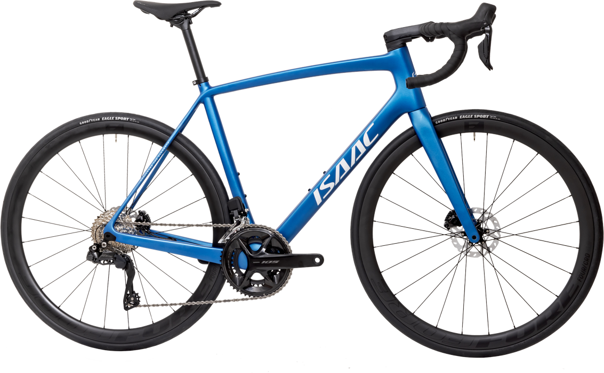
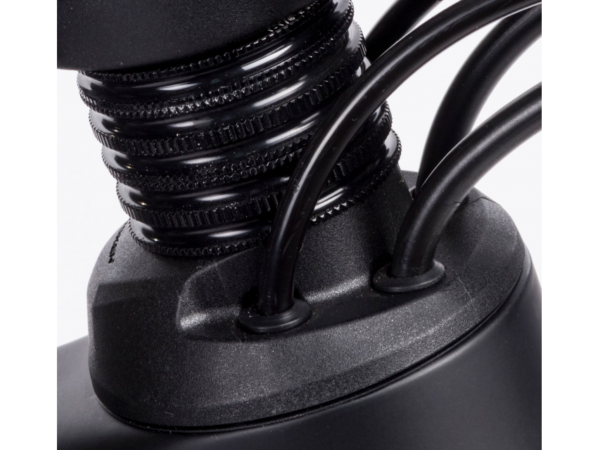
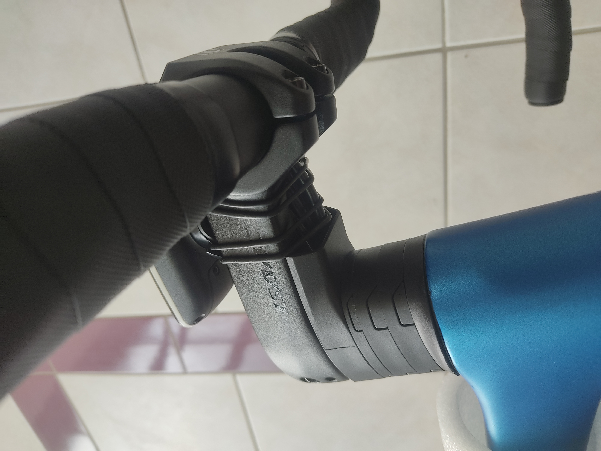
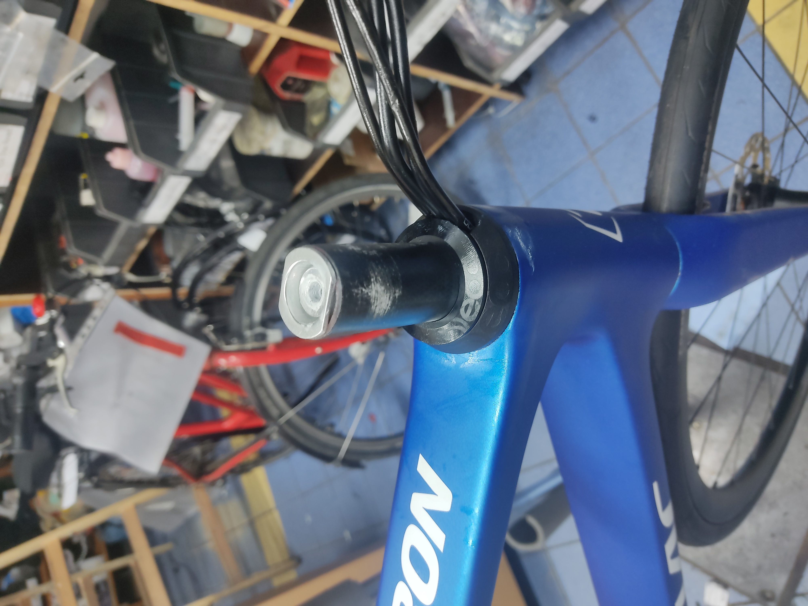
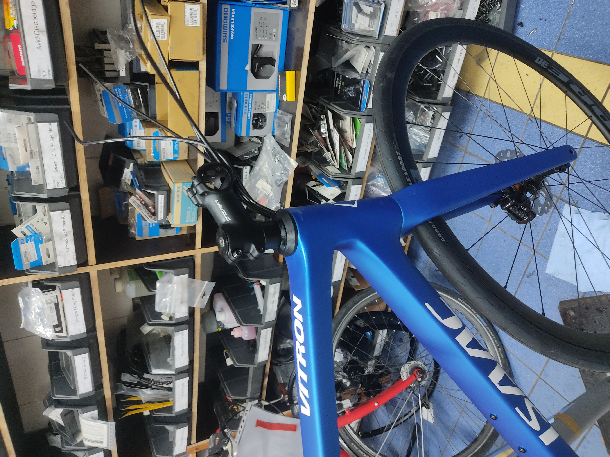

+++
title = 'Hard fought freedom: how to use any stem on an MY24 Isaac Vitron'
date = 2024-11-24T08:52:00+01:00
draft = false
+++

A variety of factors recently lead to me sourcing an Isaac Vitron for a customer in September. The factors of a fitting geometry, really good price and it being a decent bike all coalesced.  
At the time I already knew I could not run the stock stem for the customer's position, but I still filed the matter away with a certain naiveté. 2023 Models used the Token S-Box system and while the degree of integration looked higher in 2024, surely it couldn't be that bad, right?

 The bike in it's 2024 guise.

 A token S-Box setup, note the normal spacers.

When the bike arrived I found my optimism dashed. The MY24 Vitron uses some variant of the Token's "C-Box" system, which means a custom stem and custom spacers if you don't want the whole thing to look like a trainwreck. Said custom stem does not come in 80mm/17°+ because why the hell would it, and Isaac was either unable or unwilling to provide much help, let alone provide *any* different stem from the one that came with the bike, not that I think it would have mattered. Cables also ran through the handlebars, also not terribly relevant since the bike was going to be converted to di2 too (different story). And while Isaac was not a helpful avenue, neither was Token, who don't really have an aftermarket distribution to speak of, at least not in Europe nor any other support. No S-Box parts for me.

 My coworker's Vitron, he has no qualms about the stem, which means we can view the original configuration.

Any sufficiently specialized online chatroom will have a guy who knows too much. In my usual bikechat that person is S.  
S. understands bike handling better than most people who are paid to do so, has designed handlebars effectively pro bono and he is always suspiciously well informed not just on bike matters. We jokingly refer to him as our CIA handler sometimes, the fact that he lives in the Washington DC area only deepens those suspicious.  
S. is also very sharp in matters of headset cable routing and ever helpful, so we sat down and got to work.

The lower portion of the headset could stay, we only really needed the top bit. IS52, 45/45° bearings, ideally available as bits and cable routing through the headset cover but *only* the headset cover.  
FSA only does 36/45° bearings in this configuration and besides we both prefer the other option we landed on, which is Deda Elementi.  
The Deda headset is offered in both 36° and 45° variants and is a wonderfully flexible system all around.  
[They also give you great documentation](https://dedaelementi.com/media/catalog/product/attachment//d/c/dcr_headsets_1.pdf) [and even technical drawings](https://dedaelementi.com/media/catalog/product/attachment//s/-/s-dcr.pdf)  
The documentation gives us all the individual part numbers we need and the drawing reveals a crucial detail: The height of the upper bearing on the token headset is 9mm, with Deda you're looking at 8mm. Purchasing the top cover and compression ring will not suffice, we will need a bearing also. All in all the parts required were:
* BEARING 1”-1/2 for Integrated headset (IN), ACB, 51,9×40×8 mm - HDB5SUJ
* COMPRESSION RING for DCR headset, 45°×45°, PA66 - HDCOMPRDCR
* DCR MICROSPACERS - HDDCRMS
* S-DCR TOP COVER, 56 mm, Nylon, for 1.5” upper bearing - HDSDCRTC56
* HEADSET TOP COVER, 46 mm, Alloy - HDTPA46N
I immediately sat down and called German Deda distributor CCM-Sport, to see if I could get the pieces by themselves. To my delight I could, provided a bit of patience, they'd be added to the next shipment from Italy.

Said patience duly excercised, the parts arrived about three weeks later.

Installation worked like a charm and voila, a steeper stem to get the customer the riding position she needs. The shift housings later went with the di2 conversion but I wanted to confirm it in the mechanical setup first.

MCG's in-house brand Procraft once again proves to be an invaluable ally to ergonomics. I have yet to find somebody else readily offering stems in 10mm increments in 6°, 17° and 25° angles. And at wonderfully cheap prices no less.