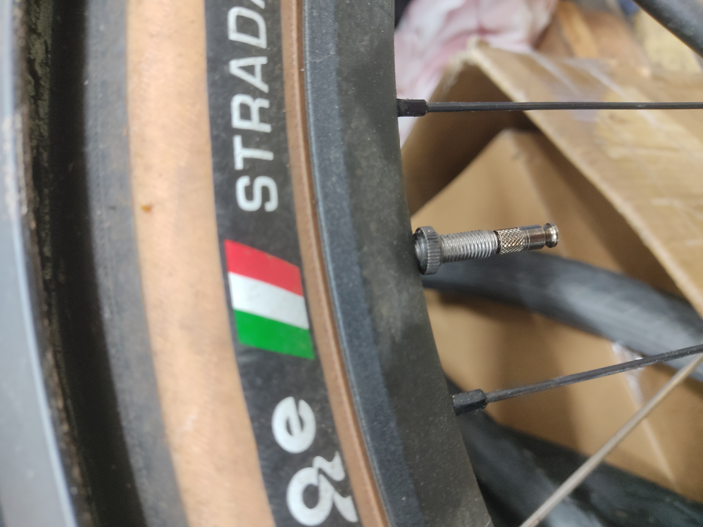
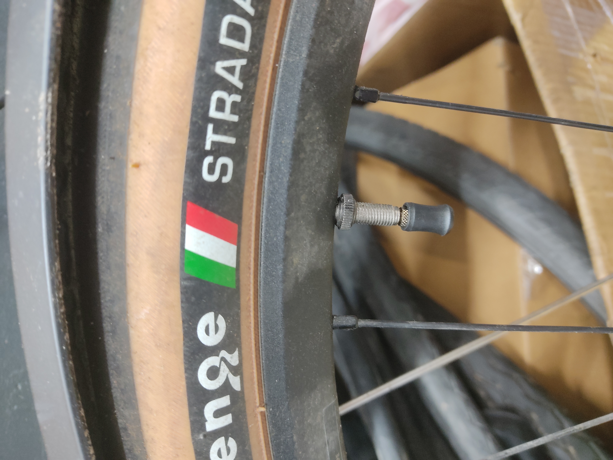

+++
title = 'Clik Valve at last: brief first impressions'
date = 2025-01-21T01:26:21+01:00
draft = false
+++

Schwalbe's launch of "their" new Valve didn't quite go to timeline. [Right after they showed it at eurobike](https://www.wolfgangwiedervorname.de/posts/240708_eurobike_part_iii/) I put in an order for a bunch and our first sampler arrived two weeks ago, bit of a jump from September.
The bulk of the order is still due to arrive, this was more of a goodie from the Schwalbe sales rep. Curiosity got the better of me and I discreetly nabbed the package.

Installation was painless as expected and the functionality i.e. getting the pumphead (or in this case the adapter) is exactly as advertised. It works great. It's genuinely just head on, head off, no use of force, no loss of air, it is outstanding.

Minor observations are as follows: no external thread to be seen. This results two several things.

* Completely different valve caps. These snap on instead of threading on. It works? Doesn't feel great though.
* Doesn't work with thread-on SV chucks. This is not good for someone like me whose place is stuffed with Lezyne pumps. The adapter does not fit my Graveldrive floorpump which is SV only and the part to change that seems to be rare to come by. This is Lezyne's fault not Schwalbe's however.

Valve Cap installed

There's no option to get TPU tubes with Clik valves at the moment. With all TPU tubes I am aware of using glued in valve cores there's no way. It's a bit frustrating to have to pick between two of the hot new developments in tubes. With Schwalbe having their own TPU tubes, I do hope to see some movement on that front soon-ish, not that my 46-584 tires could make use of em. They currently do not offer any TPU tubes for that sizing, at least not officially.

[Clik corporation](https://clikvalve.com/collections/replacement-parts), the people Schwalbe is licensing this design from, have way nicer pump adapters, for a price. These are metal and the pump head also comes with compatibility for AV. Worth the premium? Probably not, but I sure wouldn't mind the option.

We'll have to see how and if customers take to em. It'll take somewhat of a marketing effort on the side of retailers and I'm not sure how many are keen to do that for something as trivial as valves.