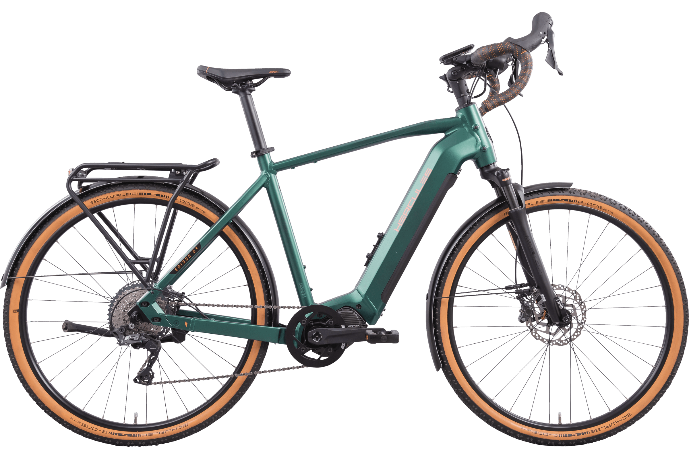
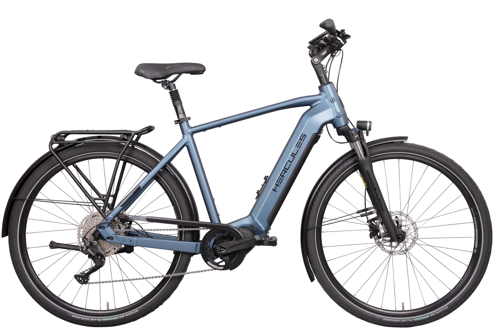
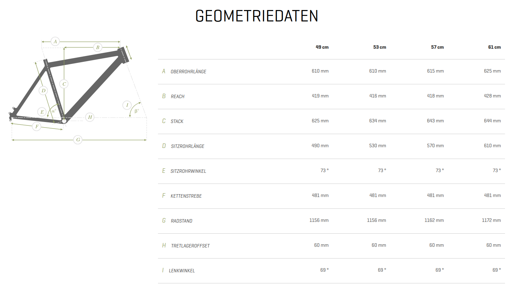
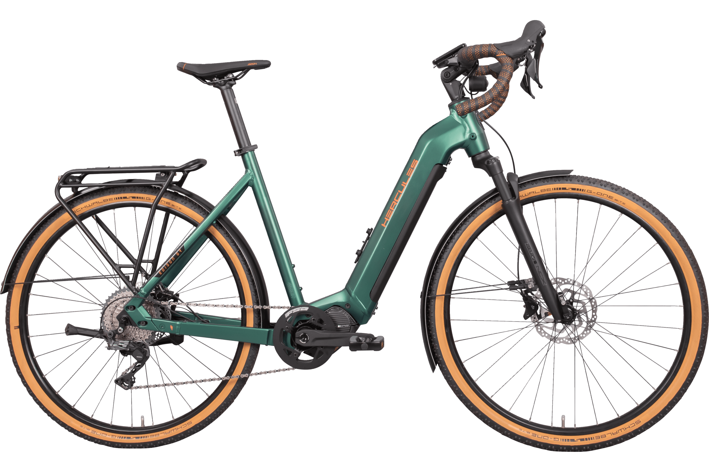
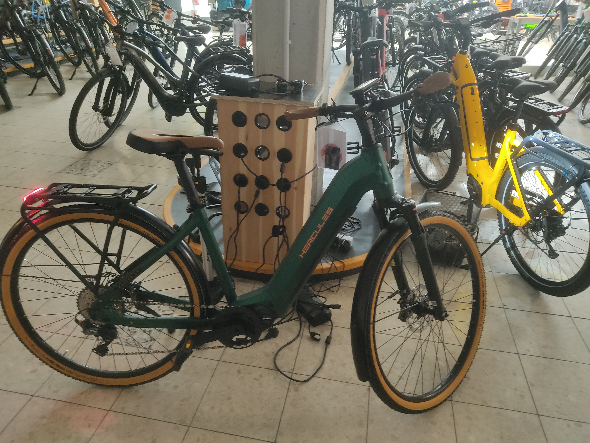

+++
title = 'Selling Hercules GR I-11s for fun and profit'
date = 2025-03-09
draft = false
+++

Back in 2022 some bright person at Hercules had the idea of hopping on the gravel e-bike trend by completely phoning it in. Enter the Edison GR I-11:

The eagle-eyed might look at this and say "this looks an awful lot like they took their regular joe-shmoe Shimano e-bike and put a set of dropbars on it". Do I have news for you.

This is the exact same frame as the flatbar Edison series Hercules was selling at the time.

They were very much going to war with the army they had. The motor controller (and the bell hilariously) couldn't fit the drop bar diameter so they put one of those accessory mounts to put them *somewhere*, an adequate rigid fork couldn't be procured or was too much effort to procure, so on goes the common SR-Suntour suspension fork, although they did shell out for an airsprung one. It's the exact same motor setup too, Simplo 630Wh battery and a Shimano Steps EP8 motor.

It is worth noting here that Shimano Di2 brifters are capable of controlling their Steps motors and this is a wonderful setup used for example by Giant on their also somewhat ill-fated but way more competently executed Revolt E+. Alas, this would have driven the already high-ish price tag of 4499€ (later 4899€) only higher.

The most egregious sin however is the frame. Many E-bike frames have infamously little thought given to rider position and equipping the already somewhat low effort Edison frame with dropbars yields disaster. 610mm effective toptube length *in the smallest size*. This by the way, barely scales, it just stays the same throughout the small sizes eventually growing to a generous 625mm in the largest size. Stack is massive, especially coupled with the Zecure stem adding another 50mm or so to the 625mm+ already present. A woefully ill-fitting geometry except for the tallest of people.

Did I mention it comes as a wave frame yet?

I think the image speaks for itself. Can you believe nobody bought these?

Last week my Boss gave me the spec sheet and said "I just got a call from our Hercules rep, they're selling these things for a dime, how much will it cost us to convert these to flatbar and make them actually sellable". An MOQ of 6 gave us pause initially, in a year where we are trying to lower our stock more than anything, but the price was entirely too good to pass up and I got to work. It appeared Hercules really wanted that inventory gone.

Parts that were absolutely necessary:

**Handlebars:** Easy to figure out. The unfortunately named Ergotec "Ladytown" is a hit with all genders in that segment of the bike market, 30° Backsweep appears to be the sweet spot for many people.

**Shifter:** Another easy one. Shimano offers exactly one option for 11-speed road flatbar shifters and it's the SL-RS700. This is an outstanding shifter, it feels nice and crisp, not that you got much of a choice anyhow. I-Spec is immediately off the table because it's only offered with I-Spec II, and finding brake levers for that would be a pain. Speaking of:

**Brake levers:** The bike doesn't have flatmount brakes, so Hercules went with Shimano BR-RS785 calipers. These use SM-BH90 high pressure hoses which aren't as common as the BH59 that are for lower pressures, at least in the low end. This should not matter to the lever, but I sure as hell did not care to experiment here. The BL-MT401 levers are cheap and officially permit both hoses (the 2-piston MT400 calipers use BH59 hoses and the 4-piston MT420 use BH90s).

**Grips:** I spent too much time thinking here. I wanted something with at least a bit of wing but still reasonably cheap. Merida-Centurion-Germany in-house brand Procraft came through on this one with their Ergo Comp IIs. I have seen this exact mold being used by other manufacturers under different names, but it's a perfectly acceptable grip. Conveniently these come in brown also. I am quite fond of the dark-green+brown color scheme Hercules did and wanted to maintain it.

Now for the part that was not necessary but I figured would be wise:

**Saddle:** The bike comes with a quite sporty Fizik Aidon which probably wouldn't sit well with the demographic I had in mind. Procraft fortunately offers a more city-bike-like saddle, in the exact shade of brown as the grips, unceremoniously titled "City II". This too is an OEM part I've seen elsewhere, but the brown is the exact same as the grips and surprisingly rare to find in this price class.

Further changes I considered but eventually shelved:

**Tires:** Stock tires are Schwalbe G-One Bite Performances. They are light, offer nice off-road grip, and roll well. What they don't really have in spades is puncture protection, a feature often sought after on e-bikes. Removing wheels on heavier bikes can be challenging for end-users. Continental's new Contact Pure would be a fantastic fit. It's lighter than Schwalbe's offerings in that area, saving about half a kilogram over Marathon Pluses, offers great puncture protection and, critically, comes in brown. Ideally it would be the 55mm version also, the 50s look a bit small on the bike, especially with the 65mm fenders. But by that point you are screwing with the bike's speed calculations and are entering legally dubious waters. We decided to keep the tires as is for now.

**Frame lock:** Honestly something we could have thrown on stock. The battery lock on the Hercules uses the Abus Plus core, which enables ordering other locks from Abus that are keyed alike. On short notice this is a bit of a pain but it would be an easy matter for stock bikes. So getting a load of 5755Ls frame locks to outfit all the bikes is a tempting option. Manufacturers like Victoria actually deliver their bikes from the factory with framelocks. This does limit consumer choice a bit so we ultimately decided against it, however personally it's something I would have done. Just nice to have.

The process of making the conversion was relatively painless. The worst part is probably the brakes, as the MT401 levers come *completely empty* leading to a somewhat lengthy bleeding process but you can still easily do it with just the funnel.

Interesting bits I noticed about the bikes throughout this:

A 34.9mm seatpost. I do not know why this is there. Maybe there was a large batch of cheap seatposts to be had in that size. The QR clamp is really nice, rubber insert in the lever and everything, but it's a headscratcher nonetheless.

Mount for a front-rack on the headtube. Good stuff, especially for a 2022 model. Hercules' solution is somewhat simplistic but the option has been popular with customers so far.

Front light is inconsistent across sizing. 45s come with a nice Litemove SEC-110, the 49s spec the much cheaper feeling Fuxon FS-100 EB. Still not bad but a downgrade. In both cases the light cable is too short to move it from the bars to the front rack.

Anyhow here's the result of it all, a better image will be here shortly:

Customer response has been outstanding, at 2000€ they're practically flying off the floor. Out of our initial batch of 6, 5 are already accounted for.